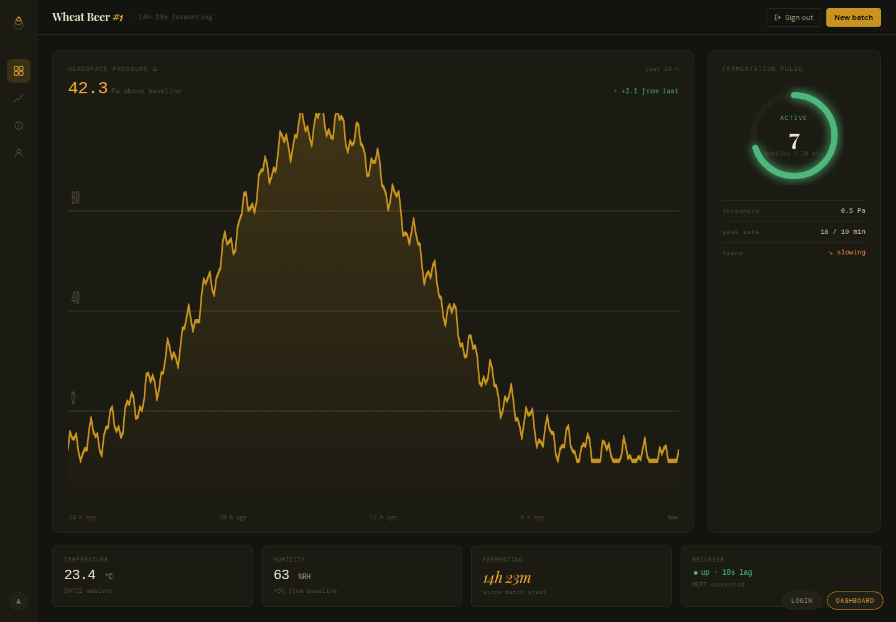
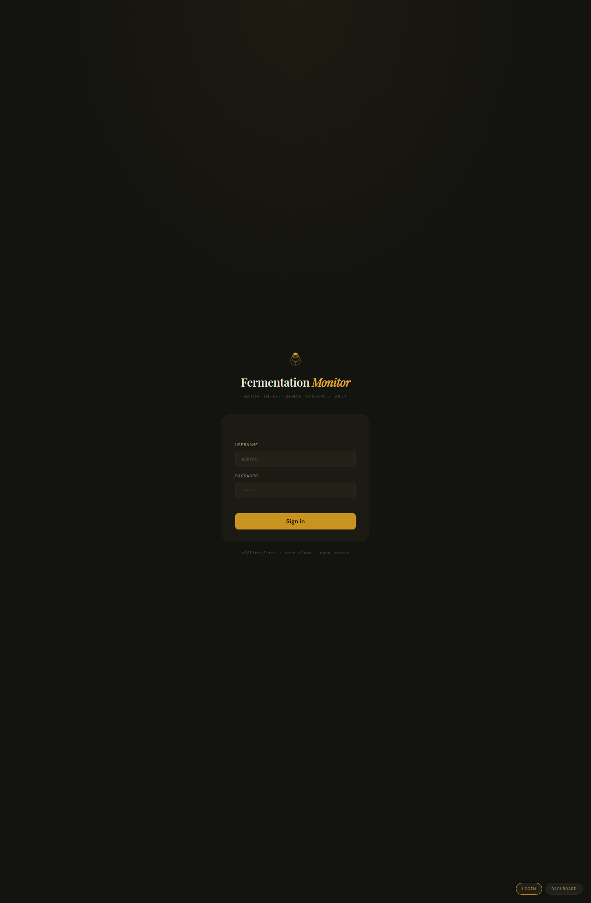

# Fermentation Monitor

ESP32 + BMP280 + DHT22 → MQTT → FastAPI + SQLite → React dashboard. Tracks CO₂ headspace pressure delta during homebrew fermentation and classifies activity state (active / slow / finished) in real time, with an on-device TinyML autoencoder flagging stuck or contaminated fermentation directly from the pressure sawtooth (see [Anomaly Detection](#anomaly-detection-on-device-tinyml) — **its ground truth is entirely synthetic; treat alerts as provisional**).



<sub>Full IIoT stack, self-proposed and built end-to-end: edge firmware → MQTT → backend → RBAC-gated real-time dashboard. Ports-and-adapters architecture, 60× Wokwi time-compression for load validation without a physical fermenter.</sub>

---

## Hardware

| Component | Qty | Notes |
|---|---|---|
| ESP32 DevKit v1 | 1 | Main MCU — WiFi + MQTT |
| BMP280 | 1 | Pressure sensor tapped into vessel headspace via second lid hole |
| DHT22 | 1 | Ambient temperature + humidity |
| 4.7 kΩ resistor | 1 | DHT22 pull-up on data line |
| Silicone tubing | ~15 cm | Connects BMP280 port to vessel headspace |

### Wiring

| ESP32 pin | Connected to | Wire |
|---|---|---|
| GPIO 21 | BMP280 SDA | Green |
| GPIO 22 | BMP280 SCK | Blue |
| GPIO 4  | DHT22 DATA | Orange |
| 3V3 | BMP280 VCC, BMP280 CSB, DHT22 VCC | Red |
| GND | BMP280 GND, BMP280 SDO (→ I2C addr 0x76), DHT22 GND | Black |

BMP280 SDO tied to GND → I2C address `0x76`.

---

## Architecture

```
ESP32 (firmware)
  │  JSON over MQTT QoS 0, RETAIN=1
  ▼
Mosquitto broker (localhost:1883)
  │  paho-mqtt subscribe
  ▼
recorder.py  ──────────────▶  SQLite (WAL mode)
                                  │  sqlite3
                                  ▼
                             FastAPI (:8000)
                                  │  REST / JWT
                                  ▼
                          React Dashboard (:5173)
```

MQTT payload shape:
```json
{"ts": 1700000000, "pressure_pa": 101380.5, "delta_pa": 42.3,
 "temp_bmp": 22.1, "temp_dht": 23.4, "humidity": 63.0,
 "anomaly": false, "recon_error": 0.041}
```
`anomaly`/`recon_error` come from the on-device TinyML detector — see
[Anomaly Detection](#anomaly-detection-on-device-tinyml) below. They are present
from boot with sentinel values (`false` / `0.0`) so the payload shape never
changes shape mid-run.

---

## Quick Start

**Prerequisites:** Python 3.10+, Node 18+, PlatformIO CLI, Mosquitto.

```bash
# 1. Clone and install
git clone <repo> && cd fermentation-monitor
python -m venv .venv && source .venv/bin/activate
pip install -r backend/requirements.txt
cd dashboard && npm install && cd ..

# 2. Configure
cp backend/.env.example backend/.env
# Edit backend/.env — generate JWT secret:
#   openssl rand -hex 32
cp firmware/src/config.example.h firmware/src/config.h
# Edit firmware/src/config.h — fill SSID, MQTT_HOST

# 3. Start Mosquitto
mosquitto -c backend/mosquitto.conf -v

# 4. Seed admin user, then start backend + recorder
cd backend
python seed_admin.py
uvicorn api:app --reload &
python recorder.py &
cd ..

# 5. Start dashboard
cd dashboard && npm run dev
# Open http://localhost:5173 — sign in as admin
```

---

## Firmware

```bash
# Build and flash to real hardware
pio run -e esp32dev
pio run -e esp32dev -t upload

# Wokwi simulation (runs at 60× time compression)
pio run -e wokwi          # builds with -D SIMULATION
wokwi-cli --net firmware/ # starts sim, publishes to host Mosquitto
```

Config file: `firmware/src/config.h` (copy from `config.example.h`):

```cpp
#define SSID        "your-wifi"
#define WIFI_PASS   "your-password"
#define MQTT_HOST   "192.168.x.x"   // host IP visible from ESP32
#define MQTT_PORT   1883
#define MQTT_TOPIC  "fermentation/sensor"
#define MQTT_CMD_TOPIC "fermentation/cmd"
#define DHT_PIN     4
```

### Baseline reset

Remote (operator+): `POST /device/reset-baseline` → publishes `{"action":"reset_baseline"}` to `fermentation/cmd`.

Local: hold BOOT button (GPIO 0) for 3 s → re-runs boot baseline and saves to EEPROM.

EMA drift correction: `baseline = 0.001 × pressure + 0.999 × baseline` (τ ≈ 8 h). Prevents slow barometric drift from inflating `delta_pa`.

---

## API Reference

Base URL: `http://localhost:8000`. Auth: `Authorization: Bearer <token>` (JWT HS256, 480 min).

| Method | Path | Auth | Description |
|---|---|---|---|
| GET | `/health` | public | Liveness check |
| POST | `/auth/token` | public | Login (form: username, password) → JWT |
| GET | `/auth/me` | any | Current user info |
| GET | `/readings` | viewer+ | Sensor readings (params: `limit`, `since`) |
| GET | `/summary` | viewer+ | Activity state + bubble rate + duration |
| GET | `/batches` | viewer+ | All batches ordered newest-first |
| POST | `/batches` | operator+ | Start a new batch |
| PUT | `/batches/{id}/end` | operator+ | End an active batch |
| GET | `/batches/{id}/readings` | viewer+ | All readings for a batch |
| GET | `/users` | admin | List all users |
| POST | `/users` | admin | Create user |
| PUT | `/users/{id}` | admin | Update user (role, active) |
| DELETE | `/users/{id}` | admin | Deactivate user |
| POST | `/device/reset-baseline` | operator+ | Send reset command to ESP32 |
| GET | `/service/status` | operator+ | Recorder liveness + MQTT lag |

Get a token:
```bash
curl -X POST http://localhost:8000/auth/token \
  -d "username=admin&password=yourpassword"
```

---

## RBAC Roles



| Role | Read data | Start/end batch | Reset baseline | User mgmt | Service status |
|---|---|---|---|---|---|
| viewer | yes | no | no | no | no |
| operator | yes | yes | yes | no | yes |
| admin | yes | yes | yes | yes | yes |

---

## Activity States

Computed by `GET /summary` from a sliding 10-minute window:

| State | Condition | Meaning |
|---|---|---|
| `active` | > 3 readings with `|delta_pa| > 0.5` in last 10 min | Yeast actively producing CO₂ |
| `slow` | 1–3 readings above threshold in last 10 min | Activity tapering off |
| `finished` | 0 readings above threshold in last 30 min (and >30 min since start) | Fermentation complete |

Threshold `0.5 Pa` calibrated by live bubble test (task I4).

---

## Anomaly Detection (On-Device TinyML)

> **⚠ Ground truth is entirely synthetic — treat every alert as provisional.**
> The `stuck` and `contamination` profiles this model was trained and validated
> against were invented for this project. They have never been checked against
> a real defective fermentation batch. The numbers below (0/8 false positives,
> 8/8 detections, sub-hour latencies) describe how well the model separates its
> *own synthetic data* — they are evidence the pipeline works end to end, not
> evidence of real-world detection accuracy. See
> [`model_training/README.md` § Limitations](model_training/README.md#limitations)
> for the full breakdown of what each synthetic profile does and doesn't model.

Stuck or contaminated fermentation is detected directly on the ESP32 from the
CO₂-bubble pressure sawtooth, using a tiny autoencoder trained offline and
hand-quantized to int8 — no ML framework ships on the device.

### Why hand-rolled instead of TensorFlow Lite Micro / Edge Impulse

`CONSTITUTION.md` rules out cloud-based or third-party ML tooling by design
(see *Out of Scope*): zero-cost tooling and offline-first aren't just about
avoiding a monthly bill, they mean no framework binary blob, no vendored
runtime, and no dependency whose behavior can't be read start to finish. TFLite
Micro and Edge Impulse both satisfy "runs on-device," but neither satisfies
"fully auditable" — you'd be trusting a kernel library's fixed-point rounding
rather than being able to point at the 20-odd lines that do it. The forward
pass here (`firmware/src/autoencoder.h`, 79 lines total) is small enough that
the person shipping it can also be the person who verified it: 30
multiply-accumulates per window (5×3 + 3×5), no float matmul, no dynamic
allocation, cost measured in microseconds. The tradeoff is real — no framework
means no tooling for retraining or architecture search — but this model is
retrained on a dev machine and committed as a static header
(`firmware/src/model_weights.h`) precisely because a reflash is already
required to change it; there's no runtime-tunable path to give up.

### Pipeline

```
bubble-pressure sawtooth (BMP280, 10 Hz continuous)
        │  two-state hysteresis edge detector
        ▼
bubble events + inter-bubble intervals
        │  rolling 16-interval buffer, persists across window boundaries
        ▼
5-feature aggregation window (2 min):
  [bubble_rate, mean_interval, std_interval, interval_trend, temp_delta]
        │  z-score normalize per feature, clamp to ±6 σ
        ▼
int8-quantized 5 → 3 (ReLU) → 5 autoencoder  (firmware/src/autoencoder.h)
        │  reconstruction error = mean squared error, input vs. output
        ▼
error > AE_RECON_THRESHOLD (0.352953) for AE_ANOMALY_N_WINDOWS (3) consecutive
windows → anomaly flag, published as {"anomaly": true, "recon_error": ...}
```

The model is trained once, offline, on NORMAL-only feature vectors
(`model_training/train.py`), so reconstruction error is naturally low for
normal fermentation and high for anything the 3-unit bottleneck can't
compress — including patterns it never saw. Quantization (`quantize.py`) and
threshold/N selection (`validate.py`) happen in the same offline pipeline;
`export_weights.py` refuses to emit `model_weights.h` if validation fails, so a
model that doesn't separate normal from anomalous can't reach the firmware.
See `model_training/README.md` for the full derivation of the threshold
(geometric center of a 0.2176–0.5725 feasible band, chosen for symmetric
multiplicative margin) and of N = 3 (costs 4 minutes of latency, bought as
insurance against real-hardware glitches the synthetic data doesn't produce).

### Real problems found and fixed along the way

1. **`sim_sensors.h`'s bubble-phase math was wrong, and it mattered.** The
   original sawtooth phase was computed as
   `fmodf(t, period(t)) / period(t)` — correct only for a *constant* period.
   With the period shrinking as fermentation accelerates, the derivative of
   that expression picks up a second term that dominates at high activity:
   measured at fermentation hour 22, the intended bubble period was 8.2 s but
   the as-written formula emitted an edge every ~0.56 s (15× too fast), and
   past hour 26 the phase slope went negative — the sawtooth ran *backwards*,
   producing no bubble drops at all. Fixed by switching to a true phase
   accumulator (`phase += dt / period(t)`), which tracks the intended 1/period
   rate to within one edge per hour across the whole run. Both
   `model_training/datagen.py` (the training data source) and
   `firmware/src/sim_sensors.h` (the on-device simulator) had to carry the
   identical fix, or the firmware's simulated bubble intervals would come from
   a different distribution than the one the model was calibrated on.

2. **The bubble detector needed hysteresis, not a running-peak + refractory
   guard.** The first version tracked a running peak and fired when the
   signal fell a fixed threshold below it, using a refractory period to avoid
   double-counting. That's wrong in a way that's easy to miss: a boxcar
   smoothing filter spreads one pressure collapse over several samples, so
   the tracked peak gets reset to a mid-fall value, and the sawtooth's flat
   zero-gap that follows only needs a small downward noise excursion to
   re-trigger it. Measured on a normal run: 26 spurious short intervals (92 on
   a stuck run), each one splitting one real ~200 s interval into two and
   polluting the next 16 windows through the rolling buffer — `std_interval`
   read 92 s where the true value was ~3 s. The fix is a proper two-state
   machine (RISING tracks the peak and fires on a drop; FALLING tracks the
   trough and only re-arms after an equal-sized rise), with the drop
   threshold set to 6 Pa — the full width of the simulated ±3 Pa noise band.
   A boxcar mean of noise drawn from (−3, +3) Pa itself lies strictly inside
   (−3, +3), so its total excursion is always < 6 Pa: a flat noisy stretch
   can neither fire nor re-arm the detector, making noise-triggered false
   bubbles structurally impossible rather than just statistically unlikely.
   After the fix, detected bubble counts matched the generator's true cycle
   counts exactly (5516/5516 normal, 581/581 stuck).

3. **The interval buffer has to roll across window boundaries, and windows
   are suppressed until it's full.** Read literally, "the window's interval
   buffer" suggests resetting the buffer every 2-minute window — but near the
   start and end of a fermentation the bubble period is 200–300 s, so a
   single 120 s window can contain zero or one bubbles, leaving
   mean/std/trend undefined. The aggregator instead keeps a rolling
   16-interval buffer that persists across windows (only `bubble_rate`
   resets per window), and emits nothing until that buffer has 16 real
   intervals in it. That second part wasn't optional: allowing
   partially-filled windows pushed the normal p99 reconstruction error from
   0.2185 to 0.3134 — above the stuck class's ~0.30 floor — and destroyed
   separation between the two entirely, because a window built from 4
   intervals is a different statistical population than one built from 16.
   Cost: no anomaly detection for the first ~1.2 fermentation hours, judged
   acceptable since a batch can't be diagnosed stuck before it's had a chance
   to start.

4. **Continuous 10 Hz sampling beat the duty-cycled bursts originally
   sketched in the task plan.** The plan called for waking the BMP280 for
   short 5–10 Hz bursts to catch the sawtooth's sharp drop, then sleeping —
   an obvious power/CPU optimization. It doesn't work here: bubble periods
   run 3–300 s, so any burst window short enough to be worth duty-cycling
   drops real edges into the gaps between bursts and corrupts every interval
   measurement that straddles one — and the calibrated threshold assumes the
   reference implementation's continuous stream. The fix was to not
   optimize: one continuous 10 Hz sampler feeds the bubble detector every
   `loop()` iteration, and `publishReading()` reads its most recent sample
   instead of issuing a second, competing BMP280 read on the same I2C bus.
   At ~100 ms per read, the "wasted" continuous sampling costs about 0.1% of
   the ESP32's loop budget — there was nothing worth saving.

### Verification

No physical stuck or contaminated batch exists to test against (see the
callout above), and cloud `wokwi-cli` runs weren't available in the dev
environment used for this branch (no `WOKWI_AUTH_TOKEN`). What was verified
instead:

- **Quantization fidelity** — `quantize.py --check` compares the float numpy
  forward pass against the hand-written int8 path on held-out data: max
  reconstruction-error disagreement 0.002008 over normal + stuck windows
  (0.57% of the threshold), zero class flips at the decision boundary.
- **C-vs-Python cross-check** — `firmware/tools/host_test.py` compiles the
  actual `firmware/src/*.h` C headers on the host (via a small `Arduino.h`
  shim) and runs identical synthetic sensor streams through both the C and
  Python implementations. Measured agreement on reconstruction error: **max
  8.9×10⁻⁸** (normal), **1.9×10⁻⁷** (stuck), **2.2×10⁻⁶** (contamination) —
  float32 rounding noise, zero class flips across all three profiles.
- **Detection latency**, from the same harness driving `firmware/src/`
  through a full synthetic 35-fermentation-hour run: NORMAL never flags;
  STUCK flags at fermentation hour **8.83** (stall begins at hour 8);
  CONTAMINATED flags at hour **1.37**.
- **Build**, not simulation: all four PlatformIO environments
  (`esp32dev`, `wokwi`, `wokwi-stuck`, `wokwi-contaminated`) compile clean.

What was **not** verified: real BMP280/DHT22 noise characteristics (temperature
cross-sensitivity, barometric drift, airlock water-level effects), real WiFi/
I2C timing jitter, and — most importantly — real stuck/contaminated
fermentation behavior. All of the numbers above come from the synthetic
generator in `model_training/datagen.py`.

### Reading more

- `model_training/README.md` — full training pipeline, threshold/N derivation,
  quantization numbers, and the complete "Design decisions and deviations"
  writeup this section summarizes.
- `firmware/tools/host_test.py` / `sim_test.cpp` — the host-side cross-check
  harnesses referenced above.

---

## Environment Variables

| Variable | Default | Description |
|---|---|---|
| `JWT_SECRET_KEY` | — | Required. Generate: `openssl rand -hex 32` |
| `JWT_ALGORITHM` | `HS256` | JWT signing algorithm |
| `JWT_EXPIRE_MINUTES` | `480` | Token lifetime (8 h) |
| `DB_PATH` | `data/fermentation.db` | SQLite database path |
| `MQTT_BROKER` | `localhost` | Mosquitto host |
| `MQTT_PORT` | `1883` | Mosquitto port |

---

## Development Notes

- **SQLite WAL mode** — FastAPI and recorder write concurrently without locking.
- **EMA baseline** — α = 0.001, τ ≈ 8 h. Saved to EEPROM on boot and on reset commands.
- **NTP fallback** — If NTP sync fails (Wokwi / offline), `ts` is a relative millis value; `received_at` (server wall clock set by recorder) is always reliable for ordering.
- **QoS 0 + RETAIN=1** — PubSubClient limitation; last reading survives broker restart.
- **clean_session=False** on recorder — durable subscription, no readings lost during recorder restart.
- **DB index** — `CREATE INDEX idx_readings_received_at ON readings(received_at)` for fast time-range queries.
- **Wokwi simulation** — 60× time compression via `Sim::` functions in `sim_sensors.h`. Gaussian activity envelope simulates a full fermentation arc in ~35 min real time.
